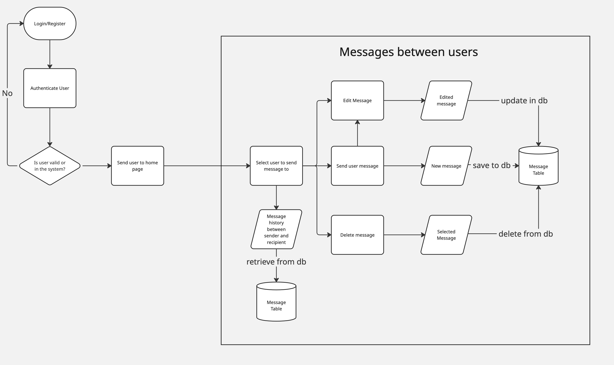
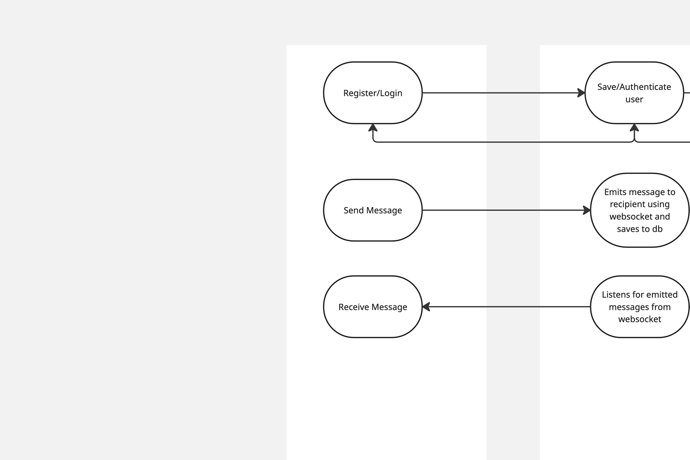
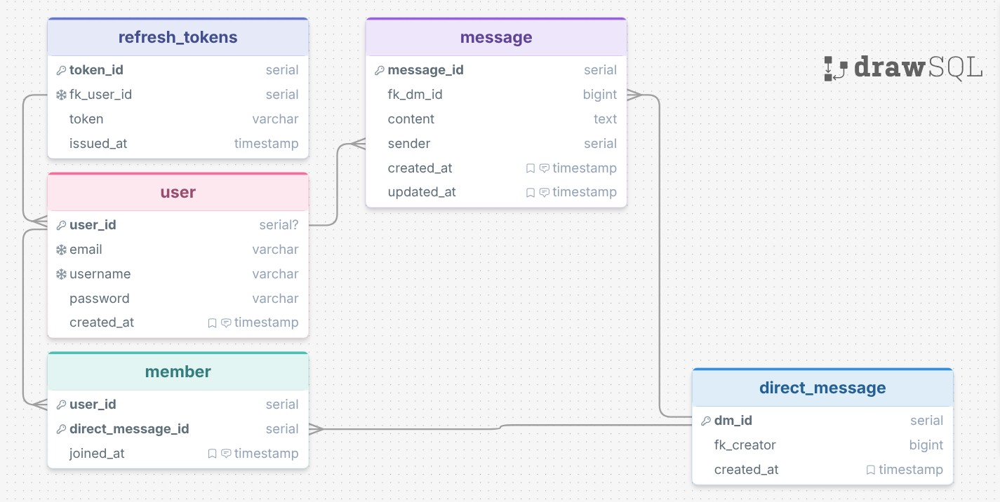
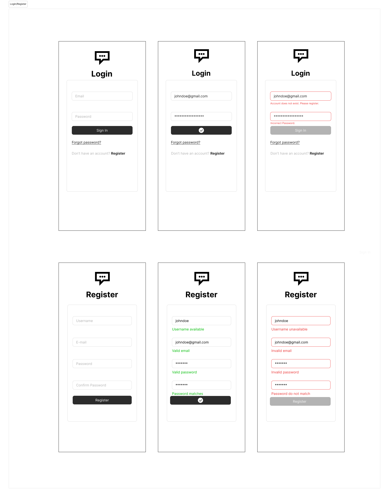

# chatterbox 

## Project Description
A full-stack chat chat application with a goal of sending messages to individuals or groups of people within chatrooms. The goal of this project is to apply knowledge of **websockets** for instant communication and notifications. **Caching** will also be implemented for faster message load times. **Cloud file storage** will be included so users will be able to send different types of media mostly aimed at images. 

## Technical Description

### Tech Stack
- React
- Express
- PostgreSQL
- AWS (File Storage)
- Redis (Caching)
- JWT (Token authentication)
- Bcrypt (Password Hashing)
- Socket.io (websockets)
- Docker
- Trello (Project Management/Kanban Board)

### User Stories

| Priority | User | Description | Technical Implementation |
|----------|------|-------------|-------------------------|
| P0 | As a user, I want to be able to register a  new account and login with my credentials. |Register new user into SQL database. Confirm login credentials by accessing SQL DB| Save new user into SQL Database. Check user credentials within DB to confirm login.|
| P0 | As a user, I want to have my sessions secured when using the app. | Authenticate the user's session.  | Generate and send JWT tokens to user's cookie.|
|P0|As a user, I want to be able to send direct messages to people and have them read instantly|Send messages to other users.|Use Socket.io to connect others and send messages instantly. Messages will be saved in DB that will show the sender and recipient.|
|P1| As a user, I want notifications when I get a new message when not directly chatting with someone | Badge notifications for new messages | Use websockets to update badge count on number of new messages not seen with a specific user.
|P1| As a user, I want my messages to be loaded quickly especially with someone I've had many conversationsn with. | Load messages quickly | Use Redis for caching for quicker message load times.|
|P1| As a user, I want to send images to other users.| Send messages with media files to others. | Use AWS storage to save file with the url saved as column with the message table of our SQL DB.
|P2| As a user, I want to be able to add friends to my friends list| Send friend requests with status pending to other users | Use websockets to emit friend request notifications. Confirm or deny friend request. Save user's friends in db.|
|P2| As a user, I want to see who is online | Show a user's online status | Use websockets to show when a user connects to one and emit their connection to everyone.
|P2| As a user, I want to create servers where I can host my friends to chat as a group| Users viewing and sending messsages to a select group of people| Use Socket.io to connect others to a 'room' in which only those individuals who are part of said room can send and see messages.
|P2| As a server admin, I want the ability to edit server details and server population. | Give server creator admin privileges.| Create Role-Based-Actions for CRUD operations with servers using authorization methods (Admin, Viewer, Editor).

### Workflow Diagram (In Progress)

### Dataflow Diagram

### Database Schema (In Progress)

### API Endpoints

#### User
- POST /register
    - Registers new user
    - Sends JWT token in cookie to client
- POST /login
    - Validates user credentials
    - Sends JWT token in cookie to client

#### Message
- POST /message
    - Adds new message with user_id for both sender and recipient. Message text is required. Img url (media) is not
- GET /message/:id
    - retrieves all messages sent to and received by recipient.
- PUT /message/:id
    - updates message
- DELETE /message/:id
    - deletes message from database

### Figma Design

#### Onboarding Design

Using Figma's simple design components. Created 3 different states (initial, success, error) for both login and register forms. No focus styling at the moment due to constraints of knowledge using Figma. Will have to make components in different states for buttons and inputs fields. However, form validation and errors are provided along with button responsives to user actions are provided. 

